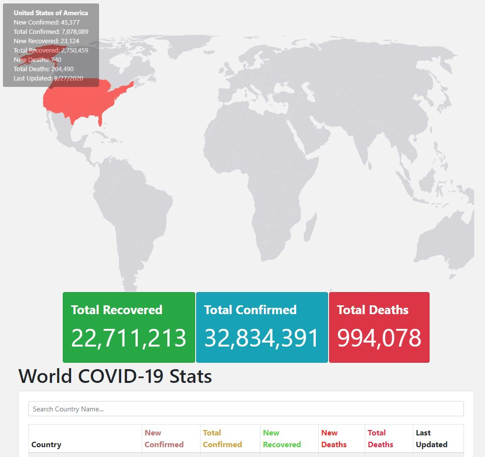
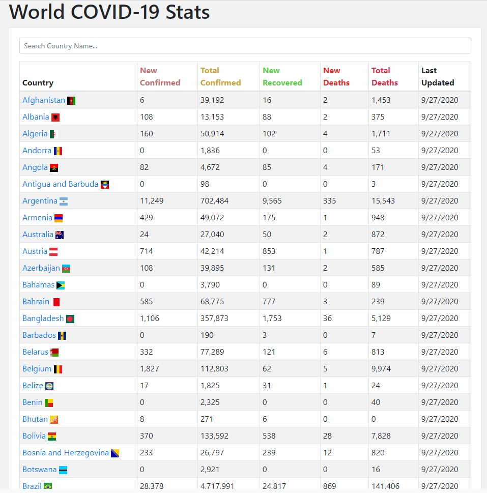
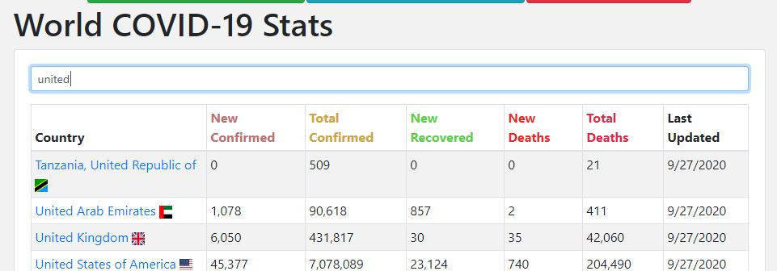
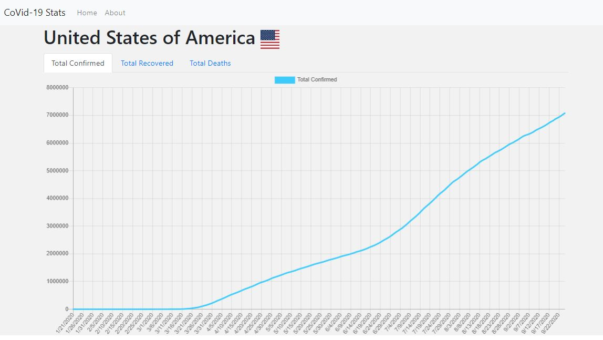

## React COVID-19 Tracking Web App

## Getting Started
In the project directory, you can run:

### `npm start`
to run the project

## Demo
A live demo website is available [here](https://chishingli.github.io/CovidApp-deploy)

## Dependencies
`react-bootstrap bootstrap`

`react-simple-maps`

`react-tooltip`

`react-router-dom`

`react-chart-js-2 chart.js`

`react-country-flag`

## Feature
- Interactive map:

- World Stats Summary:

- Search by Country:

- Detailed View by Country:

## Note
This React web app was created as an personal project. 
The data presented on this site might not be accurate or complete. 
COVID data are gathered from (http://covid19api.com/)

